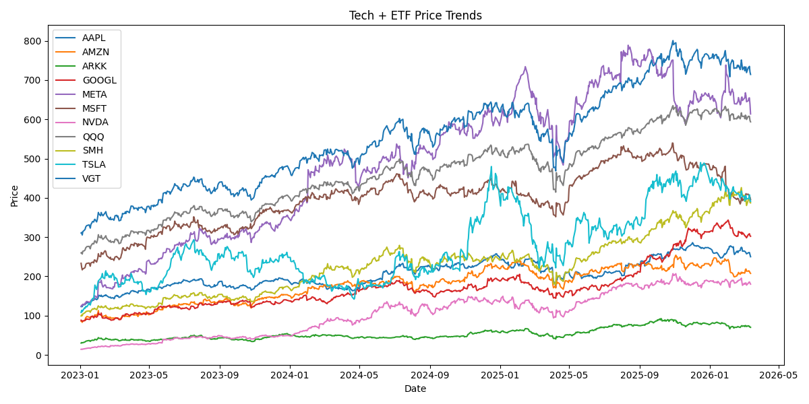
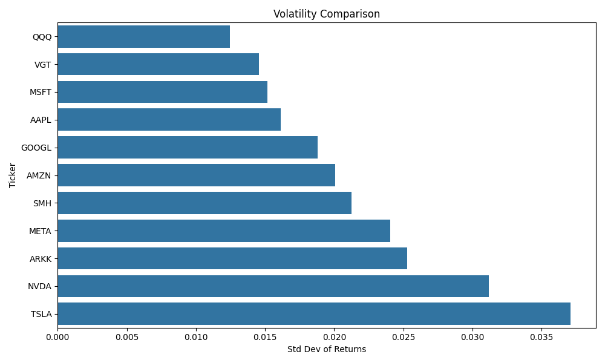
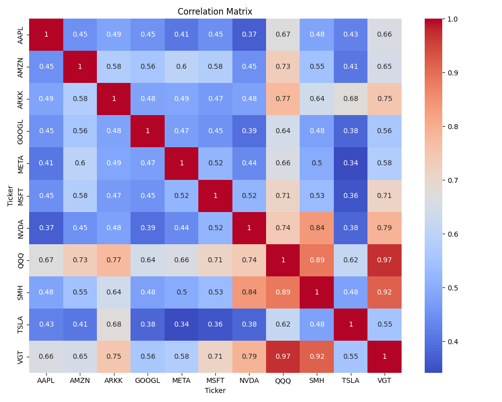

# Tech Market Pulse

Small analytics pipeline exploring performance trends across major technology companies and tech-focused ETFs.

The project automatically downloads market data and generates insights around:

• price trends  
• volatility comparison  
• cross-asset correlation  

Assets analyzed include:

AAPL  
MSFT  
NVDA  
AMZN  
GOOGL  
META  
TSLA  

QQQ  
VGT  
SMH  
ARKK  

---

## Example Output

### Price Trends

### Volatility Comparison

### Correlation Matrix

---

## Run
